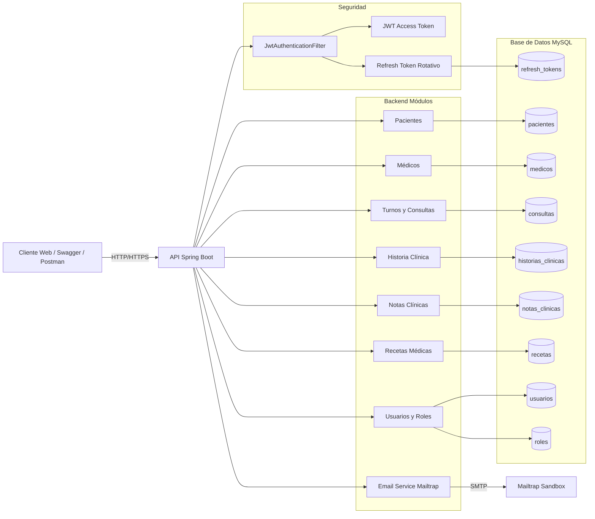
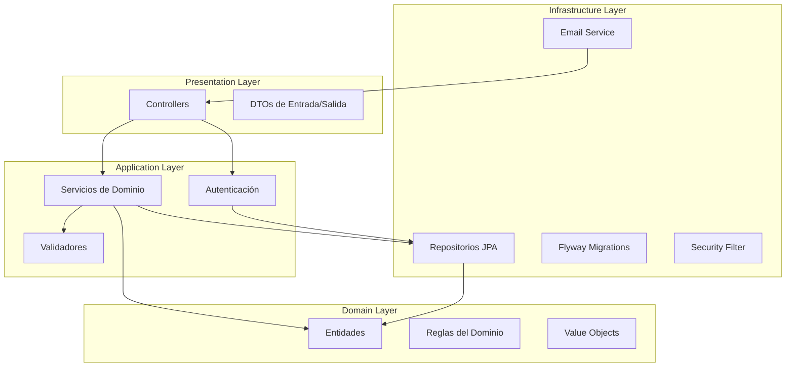
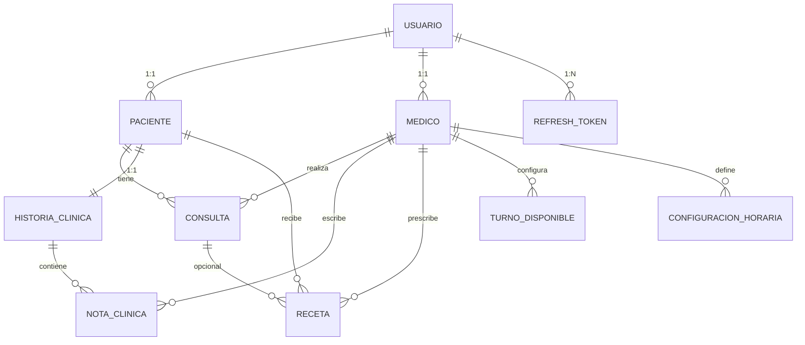
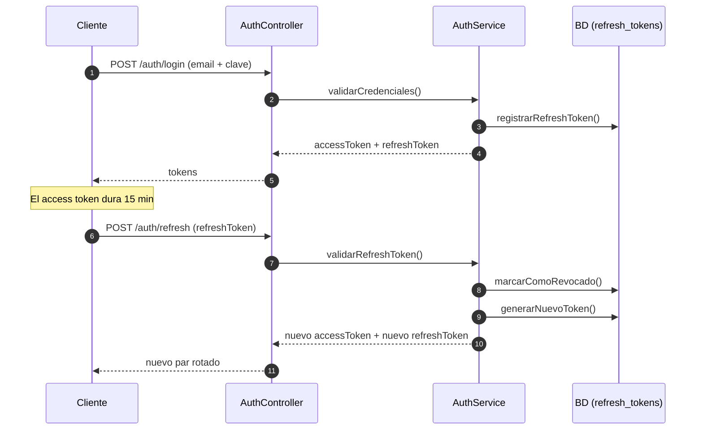

# 🏥 VollMed API — Plataforma Clínica Integral

API robusta para administración médica, turnos, consultas, historiales clínicos y recetas electrónicas.

Construido con **Spring Boot**, **Spring Security (JWT + Refresh Tokens)**, **JPA/Hibernate**, **OpenAPI 3**, **Flyway**, y **arquitectura orientada a dominio**.

## 📚 Índice

* Descripción General
* Decisiones Técnicas y Justificación
* Arquitectura del Sistema
* Módulos del Dominio
    * Médicos
    * Pacientes
    * Turnos Médicos
    * Consultas Médicas
    * Historia Clínica
    * Notas Clínicas
    * Recetas Médicas
* Seguridad y Autenticación
* Endpoints Principales
* Modelo de Datos
* Emails con Mailtrap
* Instalación y Ejecución
* Roadmap y Mejoras Futuras
---
## 🩺 Descripción General

VollMed API es una plataforma clínica orientada a resolver necesidades reales de organizaciones médicas:

* ✔ **Administración integral** de Pacientes y Médicos.
* ✔ **Gestión inteligente** de Turnos.
* ✔ **Registro completo** de Consultas.
* ✔ **Historia Clínica** con control estricto de permisos.
* ✔ **Notas Clínicas** (solo médicos).
* ✔ **Recetas Médicas Digitales**.
* ✔ **Seguridad corporativa** (JWT + Refresh Tokens rotativos + auditoría).
* ✔ **Validación por email** en flujos sensibles.
* ✔ **Documentación completa** con OpenAPI.
* ✔ **Arquitectura escalable** y extensible.
---
## 🧠 Decisiones Técnicas y Justificación

Esta sección documenta las decisiones arquitectónicas y de diseño adoptadas en **VollMed API**, detallando el "porqué" detrás de cada implementación tecnológica.

---

### 1️⃣ Infraestructura y Frameworks
* **Spring Boot 3:** Elegido como base por su ecosistema maduro, integración nativa con seguridad/persistencia y su capacidad para manejar estándares del sector salud (stateless y seguridad granular).
* **Arquitectura DDD Light:** El proyecto se divide en módulos de dominio independientes (`medico`, `paciente`, `consulta`, etc.). Esto facilita la escalabilidad y permite agregar módulos como "Internaciones" o "Laboratorio" sin afectar la base existente.
* **JPA/Hibernate + Flyway:** Se utiliza JPA para minimizar errores de SQL manual y **Flyway** para garantizar que la base de datos sea 100% reproducible y versionada en cualquier entorno.
---
### 2️⃣ Seguridad y Protección de Datos
* **JWT + Refresh Tokens Rotativos:** * *Access Token:* 15 min | *Refresh Token:* 7 días (rotación obligatoria).
    * **Justificación:** Este modelo es el estándar en organizaciones hospitalarias; minimiza riesgos de robo de identidad y permite un sistema 100% stateless.
* **Soft Delete con Auditoría Completa:** Los registros médicos nunca se eliminan físicamente (ISO 27799). Se utilizan campos `deletedAt` y `deletedBy` para permitir la trazabilidad clínica y recuperación de datos ante errores.
* **Control Estricto de Historia Clínica:** Acceso basado en el principio de *mínimo privilegio*. La lectura solo se permite si el usuario es el dueño de la historia, el médico que atendió al paciente o un administrador.
---
### 3️⃣ Lógica de Negocio y Flujos
* **Persistencia en Cascada (Notas Clínicas):** Las notas pertenecen exclusivamente a la Historia Clínica; no existen de forma independiente para evitar huérfanos e inconsistencias.
* **Gestión Automática de Turnos:** La cancelación de una consulta libera automáticamente el turno en la agenda, reflejando el flujo operativo real de una clínica y optimizando la disponibilidad.
* **Validaciones Centralizadas:** Toda la lógica de negocio reside en la capa de **Servicios**, manteniendo los controladores limpios y facilitando las pruebas unitarias.
---
### 4️⃣ Calidad de Código y Estándares
* **Desacoplamiento mediante DTOs:** Nunca se exponen las entidades JPA directamente. Esto evita ciclos JSON, protege datos sensibles y permite que la API evolucione internamente sin romper la integración con los clientes.
* **Filtros Personalizados (OncePerRequestFilter):** La validación de tokens y roles se centraliza en un filtro de seguridad, simplificando la lógica de los endpoints.
* **Simulación de Email (Mailtrap):** Uso de Mailtrap en desarrollo para verificar el formato HTML y los tokens de correo sin enviar mensajes reales a pacientes.
---
### 5️⃣ Preparado para el Futuro
* **Diseño para Microservicios:** Al mantener dominios independientes y seguridad stateless desde el inicio, el sistema está listo para ser extraído en microservicios (Agenda, Historias, Usuarios) cuando la carga de la plataforma lo requiera.
  
---

## 🏗️ Arquitectura del Sistema

### ✔ Domain-Driven Design (DDD) Light
La lógica se organiza por contextos delimitados para facilitar el mantenimiento:
* `domain/medico`
* `domain/paciente`
* `domain/consulta`
* `domain/historial`
* `domain/recetas`

**Cada módulo contiene:**
* **Entidades:** Mapeo de persistencia.
* **DTOs:** Objetos de transferencia de datos para entrada y salida.
* **Repositorios:** Abstracción de acceso a datos.
* **Servicios:** Lógica de negocio específica.
* **Validadores:** Reglas de negocio (ej. validación de horarios).

### ✔ Seguridad completamente Stateless
* **Access Token:** 15 minutos de validez.
* **Refresh Token:** 7 días con **rotación obligatoria**.
* **Logout:** Mecanismo de revocación persistido en base de datos.
* **Sin sesiones:** Cero estado del lado del servidor para máxima escalabilidad.

### ✔ Auditoría Transparente
Todas las entidades críticas heredan de `BaseAuditable`, registrando automáticamente:
* `createdAt`, `createdBy`
* `updatedAt`, `updatedBy`
* `deletedAt`, `deletedBy` (Soft Delete)

### ✔ Flyway Migrations
Estructura de base de datos totalmente **versionada, trazable y reproducible** en cualquier entorno.

---

## 🔍 Módulos del Dominio

### 👨‍⚕️ Médicos
**Atributos principales:**
* Usuario asociado, Matrícula, Especialidad, Dirección.
* Relaciones: Consultas, Recetas, Configuración de turnos.

**Reglas de negocio:**
* Solo **ADMIN** o **RECEPCIÓN** pueden crear médicos.
* Un médico puede editar solo su propio perfil.
* **Soft-delete** con auditoría (no se eliminan registros físicos).

### 👤 Pacientes
**Atributos:**
* Usuario asociado, Dirección, Fecha de alta.
* Relaciones: Consultas, Historia clínica.

**Permisos:**
* **ADMIN** y **RECEPCIÓN** pueden registrarlos.
* El paciente solo puede visualizar sus propios datos.
* Soft-delete auditado.

---

### 📅 Turnos Médicos
Sistema automático basado en la configuración horaria del médico.
* **Generación automática** de turnos disponibles.
* Marcado como **reservado** al crear una consulta.
* **Liberación** automática al cancelar.
* Validadores **anti-solapamiento** de horarios.

### 🩺 Consultas Médicas
**Contenido:**
* Médico, Paciente, Fecha/Hora, Estado.
* Motivo de cancelación (si aplica).

**Validaciones de negocio:**
* Médico disponible en el horario solicitado.
* Paciente con estado activo.
* Verificación de no duplicidad de turnos.

---

### 📘 Historia Clínica
Un paciente tiene una única y permanente historia clínica que centraliza:
* Datos demográficos del paciente.
* Notas clínicas, Consultas y Recetas.
* Registro de auditoría completo.

**Matriz de Acceso:**

| Rol | Nivel de Acceso |
| :--- | :--- |
| **ADMIN** | Acceso Total |
| **MEDICO** | Solo pacientes atendidos previamente |
| **PACIENTE** | Solo su propia historia clínica |
| **RECEPCIONISTA** | Acceso Limitado (Lectura administrativa) |

**Lógica de Validación de Acceso (Ejemplo):**
```java
boolean esPaciente = paciente.getUsuario().getId().equals(uid);
boolean esMedico = paciente.getConsultas()
    .stream()
    .anyMatch(c -> c.getMedico().getUsuario().getId().equals(uid));
```
---
### 📝 Notas Clínicas
* **Restricción:** Solo los médicos autorizados pueden crearlas.
* **Almacenamiento:** Se encuentran integradas directamente dentro de la historia clínica del paciente.
* **Auditoría:** Registro automático de trazabilidad (quién creó la nota y en qué fecha/hora exacta).
* **Persistencia:** Implementada mediante cascada (`cascade = CascadeType.ALL`) para asegurar la integridad de los datos vinculados.

---

### 💊 Recetas Médicas
**Atributos principales:**
* **Actores:** Vínculo obligatorio con Médico y Paciente.
* **Contenido:** Fecha de emisión e indicaciones terapéuticas detalladas.
* **Consulta:** Relación opcional con un ID de consulta específica para trazabilidad médica.

**Permisos por Rol:**
| Rol | Permiso |
| :--- | :--- |
| **Médicos** | Crear nuevas recetas y visualizar las emitidas por ellos mismos. |
| **Paciente** | Visualizar exclusivamente sus recetas asignadas. |
| **Recepción** | Acceso de lectura limitada para validaciones administrativas. |

**Endpoints de Referencia:**
* `POST /recetas` -> Creación de nueva prescripción médica.
* `GET /recetas/{id}` -> Consulta de detalle de una receta específica.

---
## ✅ 1️⃣ Diagrama de Arquitectura General


---
## ✅ 2️⃣ Diagrama de Arquitectura por Capas (Clean + DDD Light)


---
## ✅ 3️⃣ Modelo Entidad–Relación (ERD Completo)


---
## ✅ 4️⃣ Secuencia JWT + Refresh Tokens Rotativos


---
---

# 🛡️ Seguridad & Autenticación

La aplicación implementa un sistema de autenticación moderno y completo, desarrollado íntegramente con **Spring Security, JWT y Refresh Tokens** almacenados en base de datos.

A continuación se describe el flujo completo de seguridad, los endpoints involucrados y las decisiones de diseño adoptadas.

---

## 🔐 1. Autenticación con JWT (Access Token)

El **Access Token** es un JWT firmado con **HMAC256**, el cual funciona como la credencial de corto plazo para acceder a los recursos protegidos.

### Contenido del Token (Payload)
* **sub**: Email del usuario.
* **id**: Identificador único en la base de datos.
* **roles**: Listado de permisos (ej. `ROLE_ADMIN`).
* **iat**: Fecha de emisión (*issued at*).
* **exp**: Fecha de expiración (configurado a **15 minutos**).

### Flujo de obtención
Se genera exclusivamente al iniciar sesión de forma exitosa.

**Endpoint:** `POST /auth/login`

**Respuesta de ejemplo:**
```json
{
  "access_token": "<jwt_string>",
  "refresh_token": "<uuid_string>",
  "expires_in": 900,
  "token_type": "Bearer"
}

```
---

## 🔁 2. Refresh Tokens Rotativos (7 días)

Además del access token, el backend genera un **Refresh Token** para permitir que la sesión se mantenga activa de forma segura por periodos más largos.

### Características principales:
* **Validez:** Tiene 7 días de vida útil.
* **Formato:** Es un UUID único y aleatorio (opaco).
* **Persistencia:** Se almacena en la base de datos para control administrativo.
* **Política de Revocación:** No se eliminan físicamente; se marcan como `revoked` para mantener un historial de auditoría.
* **Rotación Obligatoria:** Cada vez que se usa un refresh token para obtener un nuevo acceso, el token anterior queda invalidado y se emite uno completamente nuevo. Esto mitiga ataques de *Token Replay*.

### Estructura de la tabla en base de datos:

| Campo | Tipo | Descripción |
| :--- | :--- | :--- |
| `id` | PK (Long/UUID) | Identificador de la entrada. |
| `usuario_id` | FK | Relación con el usuario propietario. |
| `token` | UUID (Único) | El valor del token que viaja en la petición. |
| `expiracion` | DateTime | Fecha y hora límite de validez. |
| `revoked` | Boolean | Estado del token (true = invalidado). |

---

## 🔄 3. Endpoint de Refresh Token

Este endpoint es crítico para la experiencia de usuario, ya que permite obtener un nuevo **Access Token** de forma transparente sin que el usuario tenga que volver a introducir sus credenciales (email y contraseña).

**Endpoint:** `POST /auth/refresh`  
**Header:** `Content-Type: application/json`

### Cuerpo de la petición (Request):
```json
{
  "refreshToken": "<token_uuid_actual>"
}
```

### Respuesta del servidor (Response):

```json
{
  "accessToken": "<nuevo_access_token_jwt>",
  "refreshToken": "<nuevo_refresh_token_uuid>"
}
```

### Lógica interna de seguridad:

* **✔ Validación:** El servidor comprueba que el token exista en la base de datos, pertenezca al usuario, no haya expirado y no esté marcado como `revoked`.
* **✔ Revocación:** El token utilizado se marca inmediatamente como `revoked = true`.
* **✔ Generación:** Se crea un nuevo par de tokens (Rotación) para asegurar que, si un token fuera interceptado, el atacante no pueda usarlo indefinidamente.

---
### Lógica interna de seguridad:

* **✔ Validación:** El servidor comprueba que el token exista en la base de datos, pertenezca al usuario, no haya expirado y no esté marcado como `revoked`.
* **✔ Revocación:** El token utilizado se marca inmediatamente como `revoked = true`.
* **✔ Generación:** Se crea un nuevo par de tokens (Rotación) para asegurar que, si un token fuera interceptado, el atacante no pueda usarlo indefinidamente.

---
### Comportamiento:

* **✔ Revocación:** Marca el token como `revoked = true`.
* **✔ Persistencia:** No se elimina de la base → queda registro para auditoría.
* **✔ Seguridad:** Evita que el token pueda ser usado nuevamente en `/auth/refresh`.
* **✔ Acceso:** No requiere access token (igual que en sistemas como Auth0).

---

## ✉️ 5. Recuperación de Contraseña vía Email

El sistema incluye un proceso seguro de recuperación de clave basado en tokens de un solo uso para garantizar la identidad del usuario.

### ➤ Paso 1: Solicitar reset de contraseña
El usuario ingresa su correo y el sistema genera un vínculo temporal.

**Endpoint:** `POST /auth/forgot-password`
```json
{
  "email": "usuario@example.com"
}
```

* Se genera un token de un solo uso.
* Se envía por email un enlace con token.

### ➤ Paso 2: Confirmar cambio de contraseña
El usuario utiliza el token recibido para establecer su nueva clave.

**Endpoint:** `POST /auth/reset-password`

```json
{
  "token": "<token_recibido>",
  "nuevaClave": "xxxxxxxx"
}
```

### Reglas de seguridad aplicadas:

* **✔ Token con expiración**
* **✔ Eliminación tras uso**
* **✔ Notificación por email al usuario**

---

## ✉️ 6. Cambio de Email con Confirmación

El usuario puede actualizar su dirección de correo electrónico, asegurando la validez de la nueva cuenta mediante un flujo de doble verificación.

### Proceso de seguridad:
1. Se genera un token temporal de alta entropía.
2. Se envía un email con un enlace de confirmación a la nueva dirección.
3. Solo al confirmar el token, se procede a actualizar la dirección en la base de datos.

### Endpoints involucrados:

**Solicitud de cambio:**
`POST /usuario/cambio-email`

**Confirmación definitiva:**
`POST /usuario/confirmar-cambio-email`

---

## 🔑 7. Seguridad con Roles

El sistema implementa autorización basada en roles (RBAC) inyectados directamente dentro del payload del JWT. Esto permite al backend y al frontend validar permisos sin consultas adicionales a la base de datos en cada petición.

### Roles definidos:
* **ROLE_ADMIN**: Acceso total a la administración y configuración.
* **ROLE_MEDICO**: Gestión de historiales clínicos y consultas.
* **ROLE_RECEPCIONISTA**: Gestión de agendas, citas y pacientes.

### Implementación técnica:
Se utiliza la seguridad de Spring para interceptar las rutas:

```java
.requestMatchers("/admin/**").hasRole("ADMIN")
```

### Se personaliza el acceso por cada recurso específico:

* **Médicos:** Consultas y diagnósticos.
* **Pacientes:** Datos personales y citas.
* **Consultas:** Registro y seguimiento.
* **Gestión de usuarios:** Altas, bajas y modificaciones.

---

## 🧱 8. Filtro de Seguridad personalizado

El sistema utiliza un filtro de seguridad basado en la clase `OncePerRequestFilter`, encargado de validar cada petición entrante antes de que llegue a los controladores.

### Funcionamiento del filtro:
* **✔ Extracción:** Lee el Access Token directamente desde el header `Authorization` usando el esquema *Bearer*.
* **✔ Validación:** Obtiene el email (subject) y los roles del usuario desde el JWT validando la firma.
* **✔ Autenticación:** Autentica al usuario en el contexto de seguridad de Spring Security para esa petición específica.
* **✔ Exclusiones:** El filtro ignora automáticamente los endpoints públicos (login, refresh, reset password, logout).

> [!TIP]
> **Arquitectura Stateless:** El sistema es totalmente stateless; no se utilizan sesiones de servidor (`HttpSession`) ni cookies para almacenar el estado del usuario.

---

## 🔒 9. Protección de Endpoints

El sistema divide las rutas en dos categorías principales para garantizar que solo el personal autorizado acceda a la información sensible.

### Endpoints Públicos (PermitAll)
Estos recursos son accesibles sin necesidad de un token:
* `/usuario` (POST - Registro)
* `/auth/login`
* `/auth/refresh`
* `/auth/forgot-password`
* `/auth/reset-password`
* `/auth/logout`
* `/swagger-ui/**` y `/v3/api-docs/**` (Documentación API)

### Endpoints Protegidos
* **Todo lo demás:** Cualquier otra ruta requiere un **Access Token** válido en el header de la petición.
* **Restricción adicional:** Muchos de estos endpoints requieren, además, un rol específico (ADMIN, MEDICO, etc.) validado por el filtro de seguridad.

---

## 🛡️ 10. ¿Por qué este diseño es seguro?

Este modelo de seguridad ha sido diseñado bajo estándares de grado industrial para mitigar los vectores de ataque más comunes:

* **✔ Access tokens con expiración corta:** Minimiza el tiempo de uso en caso de robo del token.
* **✔ Refresh tokens almacenados en BD:** Permite al administrador revocar sesiones sospechosas de forma instantánea.
* **✔ Rotación obligatoria:** Detecta automáticamente el uso malintencionado de tokens antiguos.
* **✔ Logout seguro:** Basado en revocación real en el lado del servidor, no solo borrado en el cliente.
* **✔ Tokens de confirmación temporales:** Los procesos de email y reset tienen expiración estricta y uso único.
* **✔ Autorización por roles:** El JWT transporta los permisos de forma íntegra y segura.
* **✔ Compatibilidad Multi-plataforma:** Al no usar sesiones ni cookies, es 100% compatible con Apps móviles y SPAs (React, Angular, Vue).
* **✔ Escalabilidad:** El diseño *Stateless* permite que la aplicación crezca entre múltiples instancias de servidor sin pérdida de datos de sesión.

---

# ✉️ Envío de Emails (Mailtrap)

La aplicación implementa un servicio de envío de emails para gestionar flujos de trabajo críticos de forma segura y eficiente.

### Casos de uso:
* **Cambio de email:** Verificación de la nueva dirección.
* **Recuperación de contraseña:** Envío de tokens de un solo uso.
* **Confirmación de acciones sensibles:** Notificaciones de seguridad.
* **Notificaciones generales:** Comunicación directa con el usuario.

Para permitir pruebas locales seguras y evitar el uso de proveedores reales en desarrollo, se utiliza **Mailtrap** en modo Sandbox.

---

## 📬 ¿Qué es Mailtrap?

**Mailtrap** es un servicio que simula una bandeja de entrada para entornos de desarrollo y pruebas.

* **Seguridad total:** Permite recibir emails sin enviar nada al mundo real (evita el spam accidental).
* **Inspección técnica:** Permite ver contenido HTML, enlaces, adjuntos y headers.
* **Validación de tokens:** Ideal para revisar que los enlaces de recuperación funcionen antes de ir a producción.
* **Sin restricciones:** Evita bloqueos por límites de envío de Gmail, Outlook o Amazon SES.

---

## ⚙️ Configuración en el Proyecto

El sistema utiliza el protocolo **SMTP** para el envío de correos.

### Variables de Entorno
Debes configurar los siguientes valores en tu archivo `.env` o `application.properties`:

```properties
MAIL_HOST=sandbox.smtp.mailtrap.io
MAIL_PORT=587
MAIL_USERNAME=<tu-user-de-mailtrap>
MAIL_PASSWORD=<tu-pass-de-mailtrap>
MAIL_FROM=no-reply@vollmed.com
```
---

### ⚙️ Configuración del Bean (Spring Boot)

El proyecto usa **Jakarta Mail** con las siguientes propiedades vinculadas en el archivo `application.properties`:

```properties
spring.mail.host=${MAIL_HOST}
spring.mail.port=${MAIL_PORT}
spring.mail.username=${MAIL_USERNAME}
spring.mail.password=${MAIL_PASSWORD}
spring.mail.properties.mail.smtp.auth=true
spring.mail.properties.mail.smtp.starttls.enable=true
```

### 📨 Servicio de Envío de Emails

Toda la lógica se encapsula en un único servicio reutilizable:

```java
@Service
@RequiredArgsConstructor
public class EmailService {

    private final JavaMailSender mailSender;

    public void enviarEmail(String to, String subject, String html) {
        try {
            MimeMessage message = mailSender.createMimeMessage();
            MimeMessageHelper helper = new MimeMessageHelper(message, true, "UTF-8");

            helper.setTo(to);
            helper.setSubject(subject);
            helper.setText(html, true); // true indica que es contenido HTML

            mailSender.send(message);
        } catch (Exception e) {
            throw new RuntimeException("Error enviando email", e);
        }
    }
}
```

### ✉️ Emails Implementados

* **✔ Recuperación de contraseña:** Envía un token y un enlace hacia el endpoint `/auth/reset-password`.
* **✔ Cambio de email:** Envía un enlace de confirmación al email actual para validar el acceso en `/usuario/confirmar-cambio-email`.
* **✔ Notificación de seguridad:** Informa al usuario inmediatamente después de un cambio exitoso de contraseña.

---

### 📥 Cómo probar los emails

1. **Crear una cuenta** en Mailtrap.
2. **Ir a Inbox** → SMTP Settings.
3. **Copiar las credenciales** SMTP Sandbox.
4. **Pegar los valores** en tu archivo `.env` o `application.properties`.
5. **Ejecutar los flujos** (forgot password, etc.) desde Swagger o Postman.
6. **Revisar los correos** entrantes en tu bandeja de entrada virtual de Mailtrap.

> [!NOTE]  
> **Privacidad:** Nada se envía a direcciones reales. Solo tú puedes ver los mensajes de prueba en tu panel de Mailtrap.

--- 

## Documentación en Swagger

La documentación completa y detallada de la API está disponible en el endpoint `/swagger-ui`, donde puedes probar cada endpoint y ver la estructura de los datos esperados.

## Tecnologías Utilizadas

- **Java 17**
- **Spring Boot**: Framework principal para crear aplicaciones RESTful.
- **Spring Security**: Para la autenticación y autorización.
- **JWT**: Autenticación con tokens.
- **JPA / Hibernate**: Para la persistencia de datos.
- **MySQL** y **H2** (ambos soportados): Bases de datos.
- **Swagger**: Documentación interactiva de la API.
- **Flyway**: Migraciones de la base de datos.

## Dependencias

Algunas de las principales dependencias usadas en el proyecto incluyen:
- `spring-boot-starter-web`
- `spring-boot-starter-security`
- `spring-boot-starter-data-jpa`
- `springdoc-openapi-starter-webmvc-ui` para Swagger
- `java-jwt` para gestión de JWT
- `mysql-connector-j` para la conexión con MySQL

## Implementación de Tests

La API cuenta con una suite de tests para garantizar el correcto funcionamiento de las funcionalidades. Los tests se implementaron usando `JUnit` y `MockMvc` para verificar los escenarios de consultas en el controlador:

- **Escenario 1**: Retorna un estado HTTP 400 cuando los datos ingresados son inválidos.
- **Escenario 2**: Retorna un estado HTTP 200 cuando los datos ingresados son válidos y se genera correctamente la consulta.

El controlador de consultas se somete a estas pruebas unitarias para verificar que la API responde con los códigos de estado adecuados y que el contenido JSON devuelto es el esperado.

## Instalación

1. **Clonar el repositorio**:
    ```bash
    git clone <url-del-repositorio>
    ```

2. **Configurar la base de datos**: Asegúrate de tener una base de datos MySQL o H2 configurada y actualiza el archivo `application.properties` con las credenciales.

3. **Ejecutar la aplicación**:
    ```bash
    ./mvnw spring-boot:run
    ```

## Uso

Con la aplicación en ejecución, puedes acceder a:
- **Swagger UI**: [http://localhost:8080/swagger-ui/](http://localhost:8080/swagger-ui/) para probar los endpoints.
- **API**: Comienza a interactuar con los endpoints según lo documentado en Swagger.

---
## 🧭 Roadmap

### ✅ Implementado
* [x] **Recetas médicas:** Flujo completo de emisión y consulta.
* [x] **Historia clínica:** Sistema con control de permisos avanzados por rol.
* [x] **Auditoría automática:** Trazabilidad de creación, edición y borrado.
* [x] **Emails transaccionales:** Integración para notificaciones críticas.
* [x] **Seguridad:** JWT con sistema de Refresh Tokens rotativos.

---

### 🔜 Próximas Mejoras
* [ ] **Estados de receta:** Gestión de ciclo de vida (activa / anulada / renovada).
* [ ] **Gestión de archivos:** Capacidad para adjuntar PDFs y archivos clínicos.
* [ ] **Búsqueda Pro:** Queries avanzadas con filtros dinámicos por médico/paciente.
* [ ] **Analytics:** Módulo de estadísticas médicas y reporte de productividad.
* [ ] **Frontend:** Dashboard profesional para la administración clínica.
* [ ] **Notificaciones:** Implementación de notificaciones push en tiempo real.
---
